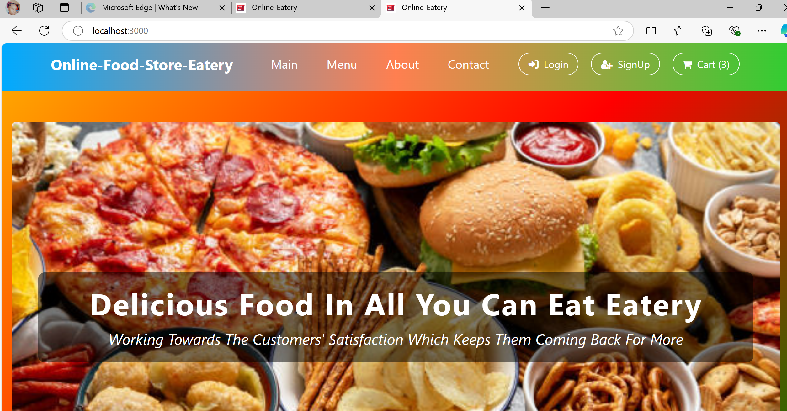
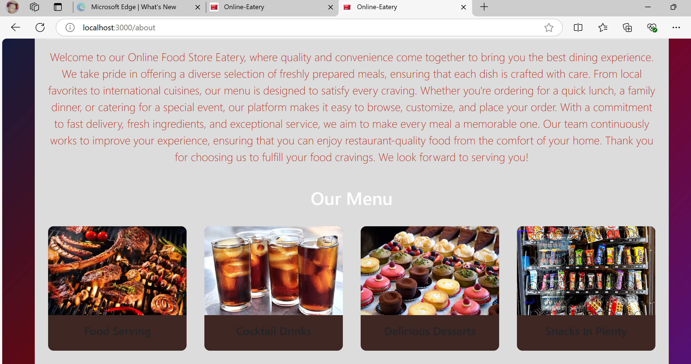

# 🍽️ Online-Food-Store-Eatery

Welcome to the **Online-Food-Store-Eatery** project! This project is a fully functional web application where users can browse, order, and have food delivered from various eateries. The application is built using modern web technologies to provide a seamless user experience.

## 📚 Table of Contents
1. [Project Overview](#project-overview)
2. [Features](#features)
3. [Technologies Used](#technologies-used)
4. [Installation](#installation)
5. [Usage](#usage)
6. [Contributing](#contributing)
7. [License](#license)
8. [Contact](#contact)
9. [Demo Screenshots](#demo-screenshots)


## 📖 Project Overview

The **Online-Food-Store-Eatery** is designed to facilitate online food ordering and delivery services. The platform allows users to explore various menus, place orders, and track delivery status. This project aims to streamline the food ordering process for both customers and restaurant owners.

## 📸 Demo Screenshots





## 🌟 Features

- 🛒 **Order Management**: Browse through different menus and place orders.
- 🔄 **Real-Time Updates**: Track the status of your order in real-time.
- 🧾 **Payment Integration**: Secure online payment processing.
- 📍 **Location Services**: Automatic detection of user's location for faster delivery.
- 🖥️ **Admin Dashboard**: Manage menus, orders, and users from a centralized dashboard.

## 🛠️ Technologies Used

- **Frontend**:
  -  - For structuring web pages.
  -  - For styling and designing the web pages.
  -  - For interactive and dynamic user interfaces.
  -  - For responsive design.

- **Backend**:
  -  - For server-side development.
  -  - For building web applications and APIs.
  -  - For static typing in JavaScript.

- **Database**:
  -  - For storing user and order data.

## ⚙️ Installation

To get the project up and running on your local machine, follow these steps:

```bash
# Clone the repository
git clone https://github.com/ReinaLalitta/Online-Food-Store-Eatery

# Navigate to the project directory
cd online-food-store-eatery

# Install frontend dependencies
npm install

# Start the development server
ng serve
For backend setup:

bash
Copy code
# Install backend dependencies
npm install

# Start the backend server
node server.js
🚀 In your local environment (e.g., VS Code, WebStorm, Sublime Text, Atom, Brackets, etc.), install the Live Server Extension to access the built website. Open Live Server from the VS Code search tab, which will open the deployed website in a browser tab.

🔑 Admin Login Credentials

- Username: admin
- Password: admin00000


🤝 Contributing
Contributions are welcome! If you would like to contribute to the project, please follow these steps:

Fork the repository.
Create a new branch (git checkout -b feature-branch).
Commit your changes (git commit -m 'Add new feature').
Push to the branch (git push origin feature-branch).
Create a pull request.
📄 License
This project is licensed under the MIT License - see the LICENSE file for details.

📧 Contact
For any inquiries or feedback, please reach out to me at lalittaruby@gmail.com.

Made with ❤️ by Purity Elna Lutta